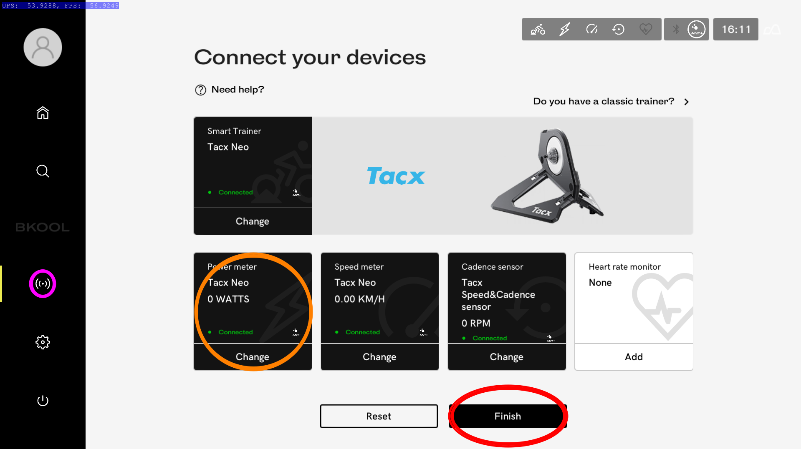
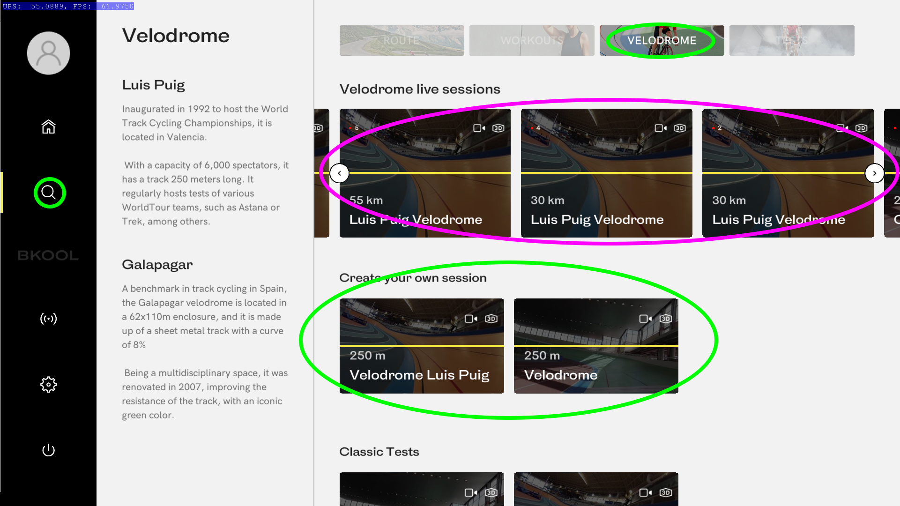

Instruction for BKOOL
..

Create an account

..
 
1. Open [BKOOL registration webpage](https://www.bkool.com/en/register)
1. Fill in login details
  * Tick - I'm not a robot
  * Tick - Agree to the terms of use
  * Click - Register
1. Fill in billing information
  * Click - Continue
1. Fill in payment information, click:
  * Tick - Agree to the terms of Payment
  * Click - Start free Trial
..

**Cancel Subscription** - Recommended to do this now as doesn't impact 30-day premium free trial can always reactivate later

..
 
1. Login [BKOOL webpage](https://www.bkool.com/en/login) using email address and password when creating account.
1. Once the BKOOL dashboard is displayed
  * Click - your registered first name at the top right
  * Click - subscription from the dropdown box that appears
1. From the My subscription webpage
  * Click - Cancel your subscription at the bottom of the screen.
1. From the cancelation webpage
  * Tick - an option
  * Click - Cancel my subscription
..

Basic Customisations

..
 
1. Login [BKOOL webpage](https://www.bkool.com/en/login) using email address and password when creating account.
1. Once the BKOOL dashboard is displayed
  * Click - your registered first name at the top right
  * Click - my profile from the dropdown box that appears
1. From the My profile webpage locate the box to the right label links the as required 
  * Switch - connect with Strava (Will need to supply strava login details and authorise)
  * Switch - Garmin (Will need to supply garmin connect login details and authorise)
  * Switch - Training Peaks (Will need to supply TP login details and authorise)
1. From the My profile webpage locate the tab bar accross the top 
  * Click - workout zone, review and set manually if required
..

Download and Install Windows

..
 
1. Click [https://www.bkool.com/en/download/windows](https://www.bkool.com/en/download/windows) 
to download **setup.exe** to your computer.
1. Double Click the downloaded **setup.exe** to run the installer.
  * Select - language
  * Click - Ok
  * Read / Select - I accept the the agreement
  * Click - Next
  * Click - Install
  * Enjoy a cuppa whilst installer completes
  * Click - Next
  * Click - Finish
..

BLE (Bluetooth Low Energy) Pairing for Wattbike PRO

..
 
For your Wattbike Pro to work, it’ll need a Model B monitor that was sold after 2013. This monitor is what transmits data from your bike in either BLE or ANT+. If you’re not sure what model you have, check the back of your monitor. Prior to connecting, complete the steps below:

  * If you're looking to upgrade to a Model B, contact [Wattbike](https://wattbike.com/gb/contact).

  * Update the firmware on the Model B computer to the latest available version.

    * For Mac and Windows 7 or 8 users, you can download Wattbike's [automatic updater app](https://wattbike.com/us/downloads). For Windows 10 users, check out this tutorial [video](https://support.wattbike.com/hc/en-us/articles/115003126885-Model-B-Performance-Monitor-Firmware-Update-Windows-Manual-Method) to manually update your firmware.

  * On your Wattbike monitor, set your ANT+ channel to the combined channel called Bike Speed and Cadence and Power (SPC & PWR).
    * 	Check out Wattbike's video [tutorial](https://www.youtube.com/watch?v=jOPYkeHTOzo) if you need instructions on how to set up your Model B computer.

  * To prevent your cadence from cutting in and out, turn off the Wattbike speed/cadence ANT + stream.
    * The Wattbike will still transmit cadence as long as the power stream is turned on.

To pair your Wattbike Pro over BLE, turn on your Wattbike and follow these steps:
..

1. On your Wattbike, turn BLE on.
  * Go to *Settings*.
  * Go to *Remote*.
  * Select *Enable Bluetooth Programming Mode*.
2. On your mobile device, open the Wattbike Hub app.
3. Pair your Wattbike with your mobile device.
4. In the Wattbike Hub app, select Active.
5. Close the Wattbike Hub app.
6. On the Wattbike, select Just Ride.
7. Once in Bkool/Zwift/Sufferfest/etcera the Wattbike should appear under the Power and Cadence categories.
..

Connect training devices via ANT+ or BLE

..
 
1. Wake up you your Training device and turn on its ANT+ or BLE transmission.
1. Start the **BKOOL cycling** software and login using email address and password previously created.
  * Click - on the transmission symbol *highlighted with pink circle in image below*
  * Review - detail of connected power meter  *highlighted with oraneg circle in image below*
    * Click - Change if need to correct
    * Click - Finish if all is good
.. 
 

..

Play Time

..

1. Highlighted in green in the image below
  * Click - on the search symbol - *left of screen*
  * Click - on the Velodrome - *top of screen*
  * Click - on either of the velodromes - *centre of screen*
1. Change the number of laps as required 
  * Click on Play button
1. Once in the session you have 10 minutes to initate the start - 
**It is recommended you do not start pedalling until other players join the warmup and confirm ready**
1. To intiate RACE Start Pedalling 
  * The countdown time will now read *to start 10 second down to RACE stop pedaling*
.. 
 

..

Also Highlighted in pink in the image above are live sessions you can join.
  * Click - on session with a summary that matches your requriements
  * Click - on Cyclists at the top of the screen to checkout the participants
  * Click - on Play to join session or left arrow to return to previous screen and find another game
 
..

